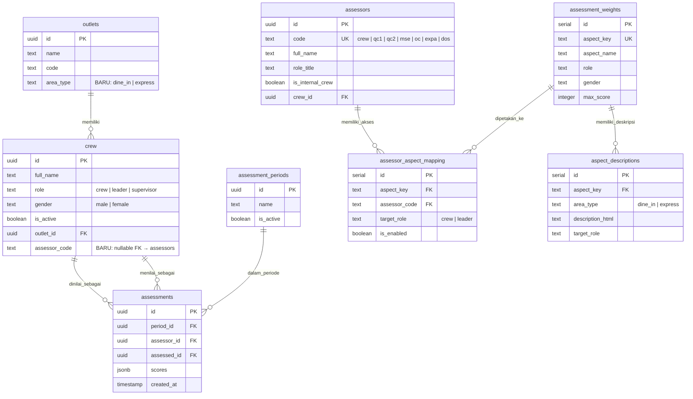

# 🚀 Rencana Pembaruan Sistem Penilaian Kru — Vibe Code Roadmap

---

## 1. 💡 IDEA

**Inti Ide:**
Memperbarui sistem penilaian kinerja kru (crew) dan pemimpin (leader) agar sepenuhnya selaras dengan dokumen operasional terbaru ([pemetaan.md](file:///c:/Users/tasya/sistem-penilaian-kru/pemetaan.md) & [template.md](file:///c:/Users/tasya/sistem-penilaian-kru/template.md)). Sistem lama hanya memiliki **7 aspek penilaian** dengan pemetaan asesor yang sederhana. Sistem baru menuntut **11 aspek** (termasuk 4 aspek baru: Kedisiplinan, Kerja Sama Tim, Tanggung Jawab SOP, dan Penanganan Komplain), perbedaan **Final Question** berdasarkan area (Dine-in vs Express), serta **matriks pemetaan asesor** yang jauh lebih granular per aspek.

**Ringkasan Perubahan Besar:**
| Fitur | Sistem Lama | Sistem Baru |
|---|---|---|
| Jumlah Aspek Penilaian | 7 | **11** |
| Diferensiasi Area | Tidak ada | **Dine-in vs Express** (beda deskripsi form) |
| Matriks Asesor | Sederhana (semua aspek muncul ke semua orang) | **Granular per aspek** — tiap asesor hanya melihat aspek tertentu |
| Identitas Asesor | Generik (Crew peer-to-peer) | **7 Asesor bernama** (Crew, QC1, QC2, MSE, OC, EXPA, DOS) |
| Deskripsi Form (Final Question) | Statis, satu versi | **Dinamis** per area (Dine-in/Express) dan per versi (lama vs baru) |
| Target Penilaian | Crew & Leader (sederhana) | **Matriks boolean berbeda** per aspek untuk Crew vs Leader |

---

## 2. 🧠 BRAINSTORMING

### Analisis Gap Sistem Lama vs Kebutuhan Baru

**A. Aspek Penilaian**
Sistem lama di [assessment-aspects API](file:///c:/Users/tasya/sistem-penilaian-kru/app/api/assessment-aspects/route.ts) menggunakan `aspectOrder` tetap:
```
leadership, preparation, cashier, order_making, packing, stock_opname, cleanliness
```
Perlu ditambahkan **4 aspek baru**:
```
discipline (Kedisiplinan & Kehadiran)
teamwork (Kerja Sama Tim)
sop_compliance (Tanggung Jawab & Kepatuhan SOP)
complaint_handling (Penanganan Komplain Pelanggan)
```

**B. Matriks Asesor Boolean**
Dari `pemetaan.md`, setiap aspek memiliki matriks **TRUE/FALSE** yang berbeda untuk setiap asesor (7 orang). Contoh untuk aspek "Persiapan":

| Asesor | Target Leader | Target Crew |
|---|---|---|
| Crew/Leader | ✅ TRUE | ✅ TRUE |
| Ramika (QC1) | ✅ TRUE | ✅ TRUE |
| Agung (QC2) | ✅ TRUE | ✅ TRUE |
| Nabila (MSE) | ❌ FALSE | ❌ FALSE |
| Raihan (OC) | ❌ FALSE | ❌ FALSE |
| Tasya (EXPA) | ❌ FALSE | ❌ FALSE |
| Reza (DOS) | ❌ FALSE | ❌ FALSE |

Ini berarti sistem harus mengenali **siapa yang login/menilai** dan hanya menampilkan aspek yang relevan.

**C. Final Question Dinamis**
Dari `template.md`, setiap aspek memiliki 2 versi deskripsi pertanyaan:
- `Final Question Terbaru Dine-in`
- `Final Question Terbaru Express`

Sistem harus menampilkan deskripsi pertanyaan yang berbeda berdasarkan **area outlet** tempat crew yang dinilai beroperasi.

**D. Penambahan Peran Asesor Non-Crew**
Sistem lama hanya mengenal `crew`, `leader`, dan `supervisor`. Sistem baru menambahkan asesor spesialis:
- Ramika → QC1
- Agung → QC2
- Nabila → Marketing Strategist Executive (MSE)
- Raihan → Operations Controller (OC)
- Tasya → EXPA
- Reza → Digital Operations Specialist (DOS)

Asesor ini bukan crew biasa — mereka adalah **evaluator lintas outlet** yang menilai berdasarkan bidang keahlian masing-masing.

---

## 3. 🎯 PROBLEM + USER

### Problem Statement
> Sistem penilaian saat ini tidak mencerminkan realitas operasional terbaru. Aspek penilaian yang tidak lengkap (hanya 7 dari 11 yang dibutuhkan) dan tidak adanya filtering per asesor menyebabkan form menampilkan pertanyaan yang tidak relevan bagi evaluator tertentu. Deskripsi aspek penilaian di form juga masih menggunakan versi lama (hardcoded di [page.tsx](file:///c:/Users/tasya/sistem-penilaian-kru/app/nilai/%5BoutletCode%5D/page.tsx#L382-L503)) dan tidak membedakan antara area Dine-in dan Express.

### Pengguna (User Personas)

| Persona | Deskripsi | Pain Point |
|---|---|---|
| **Crew (Penilai Peer)** | Kru harian di outlet, menilai rekan kerja | Melihat pertanyaan yang tidak relevan, deskripsi aspek sudah usang |
| **Leader (Penilai + Dinilai)** | Kepala shift, menilai dan dinilai | Aspek Kepemimpinan tidak dipisah, tidak dinilai oleh spesialis |
| **Asesor Spesialis** (QC, MSE, OC, EXPA, DOS) | Tim pusat yang menilai lintas outlet | **Belum punya akses ke sistem sama sekali** |
| **Supervisor/Manager** | Memberi nilai final 0-100 | Perlu melihat data dari 11 aspek, bukan 7 |
| **Admin (Tasya/EXPA)** | Mengelola data, bobot, rekapitulasi | Dashboard rekap harus menampilkan 11 aspek + filter asesor |

---

## 4. 📐 SCOPE THE MVP

### ✅ Masuk MVP (Wajib)

1. **Database:** Tambah 4 aspek baru ke tabel `assessment_weights`
2. **Database:** Buat tabel baru `assessor_aspect_mapping` untuk matriks boolean
3. **Database:** Buat tabel baru `assessors` untuk menampung identitas 7 asesor
4. **Database:** Tambah kolom `area_type` (`dine_in` / `express`) ke tabel `outlets`
5. **API:** Update `/api/assessment-aspects` agar memfilter aspek berdasarkan asesor + target
6. **Form Penilaian:** Update [/nilai/[outletCode]/page.tsx](file:///c:/Users/tasya/sistem-penilaian-kru/app/nilai/%5BoutletCode%5D/page.tsx) agar:
   - Menampilkan deskripsi aspek sesuai area (Dine-in / Express) dari `template.md`
   - Hanya menampilkan aspek yang relevan berdasarkan identitas asesor
7. **Admin Dashboard:** Update [admin/page.tsx](file:///c:/Users/tasya/sistem-penilaian-kru/app/admin/page.tsx) agar menampilkan 11 aspek
8. **Admin Bobot:** Update [admin/weights](file:///c:/Users/tasya/sistem-penilaian-kru/app/admin/weights/page.tsx) agar mengelola bobot 11 aspek
9. **PDF Export:** Update [pdfGenerator.ts](file:///c:/Users/tasya/sistem-penilaian-kru/lib/pdfGenerator.ts) agar mencakup 11 kolom aspek
10. **Halaman Asesor Spesialis:** Buat halaman khusus untuk asesor non-crew (QC, MSE, dll)

### ❌ Di Luar MVP (Iterasi Selanjutnya)

- Notifikasi otomatis (WhatsApp/email) saat periode penilaian dibuka
- Dashboard analitik tren per periode (time series)
- Sistem autentikasi per asesor (saat ini tanpa login untuk halaman `/nilai`)
- Mobile app / PWA

---

## 5. 📋 PRD (Product Requirements Document)

### FR-01: Manajemen Aspek Penilaian Baru
- Sistem harus mendukung **11 aspek penilaian**: Kepemimpinan, Persiapan, Penerimaan Pesanan, Pembuatan Order, Pengemasan Pesanan, Stock Opname, Kebersihan & Grooming, Kedisiplinan & Kehadiran, Kerja Sama Tim, Tanggung Jawab & Kepatuhan SOP, Penanganan Komplain Pelanggan.

### FR-02: Matriks Asesor Dinamis
- Setiap aspek memiliki **matriks boolean** yang menentukan asesor mana yang berhak menilai aspek tersebut untuk target tertentu (Crew / Leader).
- Form penilaian hanya menampilkan aspek yang sesuai matriks asesor yang login.

### FR-03: Deskripsi Aspek per Area
- Setiap aspek memiliki **2 versi deskripsi** (Final Question): satu untuk Dine-in, satu untuk Express.
- Sistem memilih deskripsi berdasarkan `area_type` dari outlet tempat crew yang dinilai berada.

### FR-04: Identitas Asesor Spesialis
- Sistem harus mengenali 7 jenis asesor: Crew/Leader (peer), QC1, QC2, MSE, OC, EXPA, DOS.
- Asesor spesialis mengakses halaman penilaian yang disesuaikan dengan hak akses mereka.

### FR-05: Rekapitulasi 11 Aspek & Kalkulasi Keadilan (Fairness)
- Dashboard admin dan export PDF harus menampilkan skor dari **semua 11 aspek**.
- **Keadilan Bobot:** Sistem menghitung rata-rata rating (1-5) dari seluruh asesor (Peer + Spesialis) per aspek, lalu mengalikannya dengan `max_score` aspek tersebut. Meskipun seorang Spesialis hanya menilai 4 aspek, skor maksimal crew tetap utuh karena aspek lain mengambil rata-rata murni dari Peer.
- **Supervisor Dihapus:** Bobot 60/40 (Crew/Supervisor) sudah dihapus. Ranking sekarang 100% dari rata-rata peer+spesialis.
- Perhitungan ranking dan rata-rata mengakomodir aspek baru tanpa merugikan kru yang dinilai oleh sedikit/banyak asesor.

### FR-06: Backward Compatibility
- Data penilaian periode lama (7 aspek) tetap bisa ditampilkan di dashboard tanpa error.

---

## 6. 🔧 TRD (Technical Requirements Document)

### Stack Teknologi (Dipertahankan)
| Komponen | Teknologi |
|---|---|
| Framework | Next.js 16 (App Router) |
| Bahasa | TypeScript |
| Database | Supabase (PostgreSQL) |
| Auth | Supabase Auth (admin only) |
| Styling | Tailwind CSS + shadcn/ui |
| Form | react-hook-form + zod |
| Chart | Recharts |
| PDF | jsPDF + jspdf-autotable |

### Arsitektur Perubahan

```
┌────────────────────────────────────────────────────────┐
│ FRONTEND (Next.js App Router)                          │
│                                                        │
│  /nilai/[outletCode]  ←── Form Penilaian (Crew & Peer) │
│  /assessor/[code]     ←── Form Asesor Spesialis (BARU) │
│  /supervisor          ←── Form Supervisor              │
│  /admin/*             ←── CMS Admin                    │
│                                                        │
│  Perubahan:                                            │
│  • Dynamic Final Question per area                     │
│  • Aspect filtering per assessor matrix                │
│  • 11 aspek di dashboard + PDF                         │
└────────────────┬───────────────────────────────────────┘
                 │ API Routes
                 ▼
┌────────────────────────────────────────────────────────┐
│ BACKEND (API Routes + Supabase Admin Client)           │
│                                                        │
│  /api/assessment-aspects  → Filter aspek per asesor    │
│  /api/aspect-descriptions → Ambil deskripsi per area   │
│  /api/submit-feedback     → Simpan penilaian           │
│  /api/admin/*             → CRUD + Rekapitulasi        │
│                                                        │
│  Perubahan:                                            │
│  • Tambah query ke tabel mapping baru                  │
│  • Update logika rekapitulasi untuk 11 aspek           │
└────────────────┬───────────────────────────────────────┘
                 │
                 ▼
┌────────────────────────────────────────────────────────┐
│ DATABASE (Supabase PostgreSQL)                         │
│                                                        │
│  Tabel Baru:                                           │
│  • assessors                                           │
│  • assessor_aspect_mapping                             │
│  • aspect_descriptions                                 │
│                                                        │
│  Tabel Dimodifikasi:                                   │
│  • assessment_weights → tambah 4 aspek baru            │
│  • outlets → tambah kolom area_type                    │
│  • crew → tambah kolom assessor_type (nullable)        │
└────────────────────────────────────────────────────────┘
```

---

## 7. 🗄️ ERD / DB Schema

### Tabel Baru

#### `assessors`
Menampung identitas 7 asesor unik.

| Kolom | Tipe | Keterangan |
|---|---|---|
| `id` | uuid (PK) | Auto-generated |
| `code` | text UNIQUE | `crew`, `qc1`, `qc2`, `mse`, `oc`, `expa`, `dos` |
| `full_name` | text | Nama lengkap asesor |
| `role_title` | text | Jabatan (QC1, Marketing Strategist, dll) |
| `is_internal_crew` | boolean | TRUE jika asesor juga ada di tabel `crew` |
| `crew_id` | uuid (FK → crew.id) | Nullable. Link jika is_internal_crew = TRUE |

#### `assessor_aspect_mapping`
Matriks boolean per aspek, per asesor, per target role.

| Kolom | Tipe | Keterangan |
|---|---|---|
| `id` | serial (PK) | Auto-increment |
| `aspect_key` | text (FK → assessment_weights.aspect_key) | Key aspek penilaian |
| `assessor_code` | text (FK → assessors.code) | Kode asesor |
| `target_role` | text | `crew` atau `leader` |
| `is_enabled` | boolean | TRUE = asesor ini boleh menilai aspek ini |

**Data Seed** (berdasarkan `pemetaan.md`):
```
Kepemimpinan & Manajerial:
  Leader → [crew:T, qc1:T, qc2:T, mse:T, oc:T, expa:T, dos:T] (semua TRUE)
  Crew   → [crew:F, qc1:F, qc2:F, mse:F, oc:F, expa:F, dos:F] (semua FALSE)

Persiapan:
  Leader → [crew:T, qc1:T, qc2:T, mse:F, oc:F, expa:F, dos:F]
  Crew   → [crew:T, qc1:T, qc2:T, mse:F, oc:F, expa:F, dos:F]

Penerimaan Pesanan:
  Leader → [crew:T, qc1:T, qc2:F, mse:T, oc:F, expa:F, dos:T]
  Crew   → [crew:T, qc1:T, qc2:T, mse:F, oc:T, expa:F, dos:F]

Pembuatan Order:
  Leader → [crew:T, qc1:T, qc2:T, mse:F, oc:F, expa:F, dos:F]
  Crew   → [crew:T, qc1:T, qc2:T, mse:F, oc:F, expa:F, dos:F]

Pengemasan Pesanan:
  Leader → [crew:T, qc1:T, qc2:T, mse:F, oc:F, expa:F, dos:T]
  Crew   → [crew:T, qc1:T, qc2:T, mse:T, oc:F, expa:F, dos:F]

Stock Opname:
  Leader → [crew:T, qc1:T, qc2:T, mse:F, oc:T, expa:F, dos:F]
  Crew   → [crew:T, qc1:T, qc2:T, mse:F, oc:T, expa:F, dos:F]

Kebersihan & Grooming:
  Leader → [crew:T, qc1:T, qc2:T, mse:F, oc:F, expa:T, dos:F]
  Crew   → [crew:T, qc1:T, qc2:T, mse:F, oc:F, expa:T, dos:F]

Kedisiplinan & Kehadiran:
  Leader → [crew:T, qc1:T, qc2:F, mse:F, oc:F, expa:T, dos:F]
  Crew   → [crew:T, qc1:F, qc2:F, mse:F, oc:F, expa:T, dos:F]

Kerja Sama Tim:
  Leader → [crew:T, qc1:T, qc2:F, mse:F, oc:F, expa:T, dos:F]
  Crew   → [crew:T, qc1:F, qc2:F, mse:F, oc:F, expa:T, dos:F]

Tanggung Jawab & Kepatuhan SOP:
  Leader → [crew:T, qc1:T, qc2:T, mse:T, oc:T, expa:T, dos:T] (semua TRUE)
  Crew   → [crew:T, qc1:F, qc2:T, mse:T, oc:T, expa:T, dos:T]

Penanganan Komplain Pelanggan:
  Leader → [crew:T, qc1:T, qc2:F, mse:T, oc:F, expa:F, dos:T]
  Crew   → [crew:T, qc1:F, qc2:F, mse:T, oc:F, expa:F, dos:T]
```

#### `aspect_descriptions`
Menyimpan deskripsi "Final Question" per aspek per area.

| Kolom | Tipe | Keterangan |
|---|---|---|
| `id` | serial (PK) | |
| `aspect_key` | text | Key aspek |
| `area_type` | text | `dine_in` atau `express` |
| `description_html` | text | Konten deskripsi (HTML) dari `template.md` |
| `target_role` | text | `crew`, `leader`, atau `all` |

### Tabel Dimodifikasi

#### `outlets` → Tambah kolom:
| Kolom Baru | Tipe | Default |
|---|---|---|
| `area_type` | text | `dine_in` |

#### `assessment_weights` → Tambah 4 baris aspek baru:

| aspect_key | aspect_name |
|---|---|
| `discipline` | Kedisiplinan & Kehadiran |
| `teamwork` | Kerja Sama Tim |
| `sop_compliance` | Tanggung Jawab & Kepatuhan SOP |
| `complaint_handling` | Penanganan Komplain Pelanggan |

### Diagram ERD



---

## 8. 🏗️ PROJECT ARCHITECTURE

### Struktur Folder (Setelah Update)

```
sistem-penilaian-kru/
├── app/
│   ├── admin/
│   │   ├── crew/page.tsx          # Kelola crew (update: assessor_code)
│   │   ├── outlets/page.tsx       # Kelola outlet (update: area_type)
│   │   ├── periods/page.tsx       # Kelola periode
│   │   ├── weights/page.tsx       # Kelola bobot (update: 11 aspek)
│   │   ├── mapping/page.tsx       # ✨ BARU: Kelola matriks asesor
│   │   ├── descriptions/page.tsx  # ✨ BARU: Kelola deskripsi per area
│   │   ├── feedback/page.tsx      # Rekap feedback
│   │   ├── recap/page.tsx         # ✨ BARU: Rekap detail per crew
│   │   ├── settings/page.tsx      # Pengaturan
│   │   ├── layout.tsx             # Sidebar (update menu baru)
│   │   └── page.tsx               # Dashboard (update: 11 aspek)
│   ├── api/
│   │   ├── assessment-aspects/route.ts    # UPDATE: filter by assessor mapping
│   │   ├── aspect-descriptions/route.ts   # ✨ BARU
│   │   ├── assessors/route.ts             # ✨ BARU
│   │   ├── active-period/route.ts
│   │   ├── crew/[outletCode]/route.ts
│   │   ├── submit-feedback/route.ts
│   │   ├── submit-supervisor-assessment/route.ts
│   │   ├── get-feedback/route.ts
│   │   ├── history/route.ts
│   │   └── admin/
│   │       ├── full-recap/route.ts        # UPDATE: 11 aspek
│   │       ├── weights/route.ts           # UPDATE: 11 aspek
│   │       ├── mapping/route.ts           # ✨ BARU: CRUD matriks
│   │       └── ...
│   ├── assessor/
│   │   └── [assessorCode]/page.tsx        # ✨ BARU: Form untuk asesor spesialis
│   ├── nilai/
│   │   └── [outletCode]/page.tsx          # UPDATE: dynamic description + filtering
│   ├── supervisor/page.tsx
│   ├── login/page.tsx
│   ├── layout.tsx
│   └── page.tsx
├── components/
│   ├── charts/
│   │   └── AspectChart.tsx
│   ├── ui/                                # shadcn/ui components
│   └── logo.tsx
├── lib/
│   ├── pdfGenerator.ts                    # UPDATE: 11 kolom
│   ├── supabaseAdmin.ts
│   ├── supabaseClient.ts
│   ├── constants.ts                       # ✨ BARU: aspect keys & display names
│   └── utils.ts
├── types/
│   └── index.ts                           # ✨ BARU: shared TypeScript types
├── pemetaan.md                            # Dokumen acuan pemetaan asesor
├── template.md                            # Dokumen acuan deskripsi aspek
└── middleware.ts
```

---

## 9. 🤖 SKILLS / AGENT SKILLS

### Kemampuan yang Dibutuhkan untuk Build

| Skill | Keterangan | Status |
|---|---|---|
| Supabase SQL Migration | Membuat & menjalankan migrasi tabel baru + seed data | ⚠️ Manual via Supabase Dashboard |
| Next.js App Router | Buat route baru (`/assessor/[code]`, `/admin/mapping`) | ✅ Sudah dikuasai |
| TypeScript + Zod | Definisi tipe data & validasi form untuk 11 aspek | ✅ Sudah dikuasai |
| shadcn/ui Components | Menggunakan komponen UI yang konsisten | ✅ Sudah dikuasai |
| react-hook-form | Form penilaian dinamis berdasarkan matriks asesor | ✅ Sudah dikuasai |
| jsPDF Customization | Update kolom PDF export menjadi 11 aspek | ✅ Sudah dikuasai |
| Recharts | Update chart dashboard untuk 11 aspek | ✅ Sudah dikuasai |

---

## 10. 📝 BUILDING PLAN

### Phase 1: Database Migration (Hari 1)

> [!IMPORTANT]
> Langkah ini dilakukan di **Supabase Dashboard** (SQL Editor).

- [x] **1.1** Tambah kolom `area_type` ke tabel `outlets` (default: `dine_in`)
- [x] **1.2** Update data outlet yang sudah ada (set area_type sesuai realita)
- [x] **1.3** Insert 4 aspek baru ke `assessment_weights` (discipline, teamwork, sop_compliance, complaint_handling) dengan variasi role + gender
- [x] **1.4** Buat tabel `assessors` dan insert 7 data asesor
- [x] **1.5** Buat tabel `assessor_aspect_mapping` dan seed data dari matriks di pemetaan.md
- [x] **1.6** Buat tabel `aspect_descriptions` dan seed data dari template.md
- [x] **1.7** Tambah kolom `assessor_code` (nullable) ke tabel `assessments`

### Phase 2: Shared Types & Constants (Hari 1)

- [x] **2.1** Buat file `types/index.ts` — definisi tipe data shared
- [x] **2.2** Buat file `lib/constants.ts` — aspect keys, display names, dan order untuk 11 aspek
- [x] **2.3** Update `aspectOrder` dan `aspectDisplayNames` di semua file yang merujuk

### Phase 3: API Routes (Hari 2)

- [x] **3.1** Update `/api/assessment-aspects/route.ts`:
  - Accept parameter `assessor_code`
  - Query `assessor_aspect_mapping` untuk filter aspek
  - Return hanya aspek yang `is_enabled = TRUE`
- [x] **3.2** Buat `/api/aspect-descriptions/route.ts`:
  - Accept parameter `aspect_key` + `area_type`
  - Return deskripsi dari database
- [x] **3.3** Buat `/api/assessors/route.ts`:
  - Return daftar asesor untuk dropdown selector (exclude 'crew' dari list spesialis)
- [x] **3.4** Update `/api/admin/full-recap/route.ts`:
  - Kalkulasi skor untuk 11 aspek
  - Backward compatible dengan data periode lama (7 aspek)
  - **Supervisor dihapus**: `totalNilaiAkhir = totalNilaiCrew` (100%)
  - Pisah `peerAssessorsCount` dan `specialistAssessorsCount`
- [x] **3.5** Update `/api/admin/weights/route.ts`:
  - Support CRUD untuk 11 aspek

### Phase 4: Form Penilaian Crew (Hari 2-3)

- [x] **4.1** Update `/app/nilai/[outletCode]/page.tsx`:
  - Tambah step: identifikasi tipe asesor (crew peer vs spesialis)
  - Fetch aspek berdasarkan `assessor_code` + `target_role`
  - Fetch deskripsi aspek berdasarkan `area_type` outlet
  - Update halaman deskripsi (case `description`) dengan **Final Question** terbaru dari template.md
  - Render hanya aspek yang relevan di step `rating`
- [x] **4.2** Batal buat `/app/assessor/[assessorCode]/page.tsx` (Digabungkan ke dalam 4.1 agar lebih efisien - Spesialis memilih outlet, identitas, lalu menilai dari form yang sama).

### Phase 5: Admin Dashboard (Hari 3-4)

- [x] **5.1** Update `/app/admin/page.tsx`:
  - Tambah 4 kolom aspek baru ke tabel ranking
  - Update `aspectOrder` dan `aspectDisplayNames`
  - Update `colSpan` tabel
- [x] **5.2** Update `/app/admin/weights/page.tsx`:
  - Tampilkan 11 aspek
- [x] **5.3** Buat `/app/admin/mapping/page.tsx`:
  - Antarmuka visual untuk melihat dan mengedit matriks asesor
  - Tabel checkbox per aspek × per asesor
- [x] **5.4** Buat `/app/admin/descriptions/page.tsx`:
  - CRUD deskripsi aspek per area (Dine-in / Express)
- [x] **5.5** Update sidebar di [layout.tsx](file:///c:/Users/tasya/sistem-penilaian-kru/app/admin/layout.tsx):
  - Tambah menu Mapping dan Deskripsi Aspek

### Phase 6: PDF Export (Hari 4)

- [x] **6.1** Update [pdfGenerator.ts](file:///c:/Users/tasya/sistem-penilaian-kru/lib/pdfGenerator.ts):
  - Tambah 4 kolom baru ke tabel PDF
  - Sesuaikan `columnStyles` untuk 11 + 4 kolom (Rank, Nama, 11 Aspek)
  - Perkecil font dan lebar kolom agar muat di landscape A4

### Phase 7: Supervisor Page & Role (Dihapus)

- [x] **7.1** Supervisor assessment sudah dihapus dari sistem:
  - Kolom SPV 1 dan SPV 2 dihapus dari dashboard
  - Bobot 60/40 (Crew/Supervisor) dihapus, ranking murni 100% peer+spesialis
  - Halaman `/supervisor` dan page-page terkait supervisor sudah dihapus dari codebase
  - Role `supervisor` dihapus dari dropdown, tipe data, dan semua kru dengan role `supervisor` dihapus dari database
  - Outlet `Central` (yang merupakan kantor pusat, bukan outlet) beserta krunya sudah dihapus dari database

### Phase 8: UI/UX Refactor Form Penilaian (Carousel/Wizard)

- [x] **8.1** Refactor `/app/nilai/[outletCode]/page.tsx`:
  - Rombak long-scroll menjadi **Carousel / Step-by-Step** (1 aspek per layar)
  - Auto-slide 400ms setelah rating dipilih
  - Navigasi manual (Back/Next) + dot indicators
  - Dynamic progress bar "Aspek X dari Y"
  - Framer Motion swipe transitions (spring animation)
  - Rating Cards interaktif dengan hover scale dan active state
  - Mobile-first thumb-friendly layout
  - Success animation (CheckCircle2 spring) + quick-action "Lanjut Nilai Crew Lain"
  - Deskripsi aspek di-render sebagai Markdown (react-markdown)
- [x] **8.2** Install `framer-motion` dan `react-markdown`
- [x] **8.3** Tambah CSS `.aspect-description-markdown` ke globals.css

### Phase 9: Halaman Khusus Asesor Spesialis

- [x] **9.1** Buat `/app/nilai/assessor/page.tsx`:
  - Satu link untuk semua outlet (`/nilai/assessor`)
  - Flow: Pilih identitas spesialis → Pilih outlet → Pilih crew → Wizard rating → Success
  - Quick-action "Lanjut di Outlet Ini" atau "Ganti Outlet" setelah submit
  - Deskripsi aspek dinamis per `area_type` outlet yang dipilih
  - Reuse komponen RatingCard, WizardProgress, dan Framer Motion dari halaman utama
- [x] **9.2** Update `/api/outlets/route.ts`: return `outlet_code` dan `area_type`

---

## 11. 🎨 UI DIRECTION / THEME

### Prinsip Desain
- **Warna utama dipertahankan**: `#033F3F` (Dark Teal / Hijau Balista)
- **Design system**: shadcn/ui (sudah dipakai, tetap dipertahankan)
- **Mobile-first**: Form penilaian diakses dari HP crew di outlet

### Perubahan UI Utama

| Area | Perubahan |
|---|---|
| Form `/nilai` | Tambah step "Pilih Tipe Penilai" (Crew vs Spesialis) sebelum step penilaian |
| Halaman Deskripsi | Konten dinamis dari database, bukan hardcoded HTML |
| Admin Dashboard | Tabel diperluas menjadi 11 kolom + horizontal scroll yang smooth |
| Admin Sidebar | Tambah 2 menu: "Pemetaan Asesor" dan "Deskripsi Aspek" |
| PDF | Layout kolom diperkecil dengan font lebih kecil untuk 11 aspek |

---

## 12. 🔨 BUILD THE MVP

> Ini adalah fase eksekusi. Setiap item di Building Plan (section 10) dikerjakan secara berurutan.

**Urutan Eksekusi:**
1. Database migration (SQL) → Jalankan di Supabase Dashboard
2. Shared types & constants → Kode
3. API routes → Kode
4. Form penilaian → Kode
5. Admin dashboard → Kode
6. PDF export → Kode
7. Supervisor page → Review

---

## 13. 🛠️ ADMIN / CMS

### Halaman Admin Baru

1. **`/admin/mapping`** — Matriks Asesor
   - Tampilan tabel grid: baris = aspek, kolom = asesor
   - Setiap sel berisi checkbox (TRUE/FALSE)
   - Tab untuk toggle antara "Target Crew" dan "Target Leader"
   - Tombol "Simpan Semua"

2. **`/admin/descriptions`** — Deskripsi Aspek per Area
   - Dropdown pilih aspek
   - Tab Dine-in / Express
   - Text editor untuk konten deskripsi
   - Preview mode

3. **Update `/admin/weights`** — Bobot 11 Aspek
   - Tabel sudah ada, tinggal tambah 4 baris baru dari database

---

## 14. 🧪 TESTING

### Checklist Testing Manual

| # | Test Case | Expected |
|---|---|---|
| T-01 | Buka `/nilai/KBP` → Pilih nama crew → Pilih rekan → Rating | Form hanya menampilkan aspek yang sesuai matriks (tanpa Kepemimpinan jika target = crew) |
| T-02 | Buka `/assessor/qc1` → Pilih outlet → Pilih crew → Rating | Hanya aspek yang TRUE untuk QC1 yang muncul |
| T-03 | Buka `/assessor/expa` → Pilih leader → Rating | Aspek Kedisiplinan, Kerja Sama Tim, SOP muncul; Persiapan tidak muncul |
| T-04 | Admin dashboard menampilkan 11 kolom aspek | Semua kolom tampil, data periode lama tetap tampil (kolom baru kosong/"-") |
| T-05 | Export PDF menampilkan 11 kolom | PDF landscape A4 tidak terpotong |
| T-06 | Halaman deskripsi aspek menampilkan konten Dine-in | Deskripsi sesuai `template.md` bagian Dine-in |
| T-07 | Halaman deskripsi aspek menampilkan konten Express | Deskripsi sesuai `template.md` bagian Express |
| T-08 | Admin mapping: toggle checkbox → simpan → reload | Data tersimpan dan ter-render ulang dengan benar |
| T-09 | Supervisor menilai crew dengan skala 0-100 | Data tersimpan dan muncul di dashboard |
| T-10 | Backward compatibility: data periode lama | Dashboard tidak error, aspek baru tampil "-" |

---

## 15. 🚀 LAUNCH

### Checklist Deployment

- [ ] Semua migrasi database dijalankan di Supabase Production
- [ ] Seed data matriks asesor dari `pemetaan.md` sudah masuk
- [ ] Seed data deskripsi aspek dari `template.md` sudah masuk
- [ ] Semua outlet di-update `area_type`-nya (dine_in / express)
- [ ] Test E2E di environment production
- [ ] Briefing ke semua asesor tentang cara akses dan penilaian
- [ ] Periode penilaian baru dibuat dan diaktifkan

### Deployment Strategy
- **Staging:** Test di branch `dev` dengan Supabase preview branch
- **Production:** Merge ke `main`, deploy via Vercel auto-deploy
- **Rollback:** Jika ada masalah, revert commit dan restore Supabase snapshot

---

## 16. 🔄 ITERATE

### Iterasi Pasca-Launch

| Prioritas | Fitur | Keterangan |
|---|---|---|
| 🔴 Tinggi | Autentikasi per asesor | Saat ini asesor spesialis tidak login. Tambahkan magic link / PIN |
| 🟡 Sedang | Notifikasi WhatsApp | Kirim reminder saat periode penilaian dibuka |
| 🟡 Sedang | Dashboard tren per periode | Grafik perbandingan skor per crew lintas periode |
| 🟢 Rendah | PWA / Mobile App | Install di HP crew tanpa perlu buka browser |
| 🟢 Rendah | Export CSV per asesor | Admin bisa export siapa menilai siapa per aspek |
| 🟢 Rendah | Audit log | Catat semua perubahan data oleh admin |

---

> [!TIP]
> Dokumen ini adalah **living document**. Setiap kali ada perubahan keputusan, update section yang relevan. Gunakan checkbox di Building Plan untuk tracking progress.
